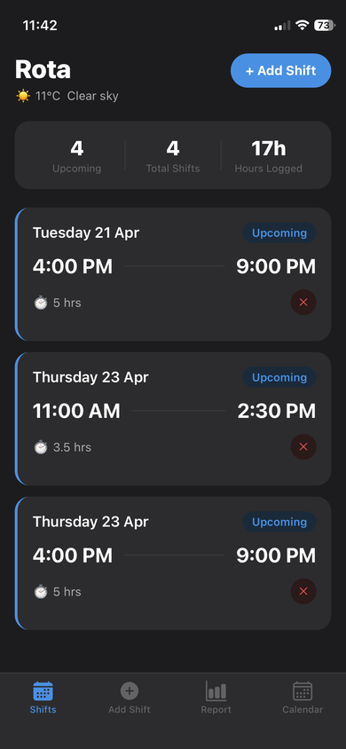
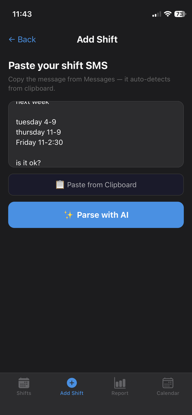
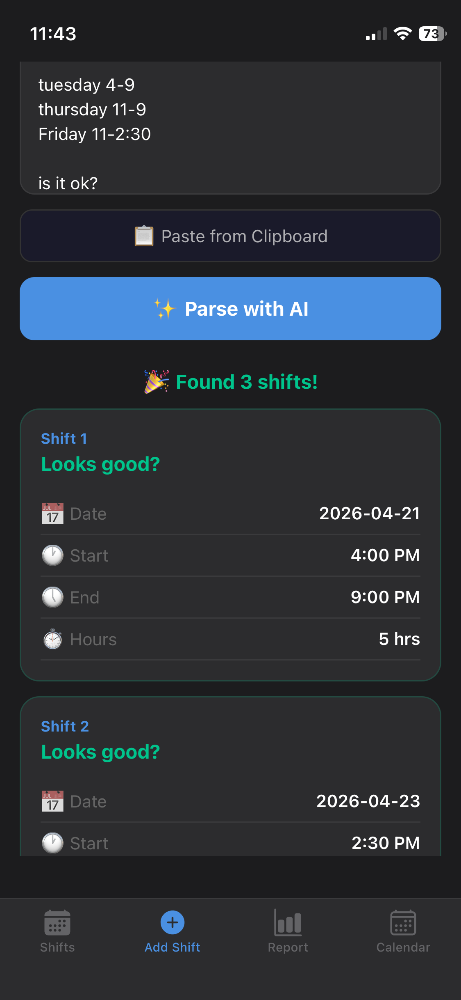
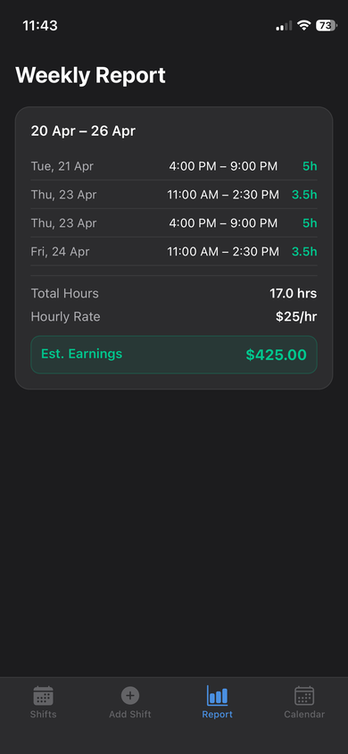
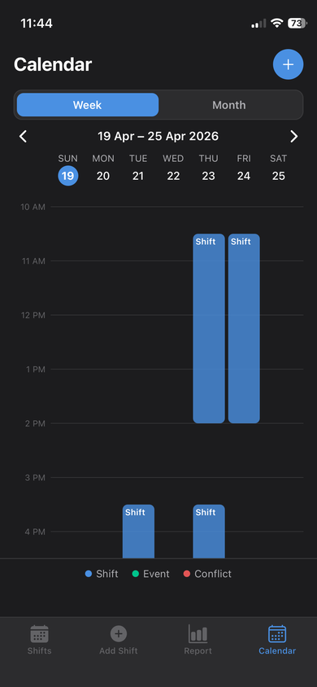
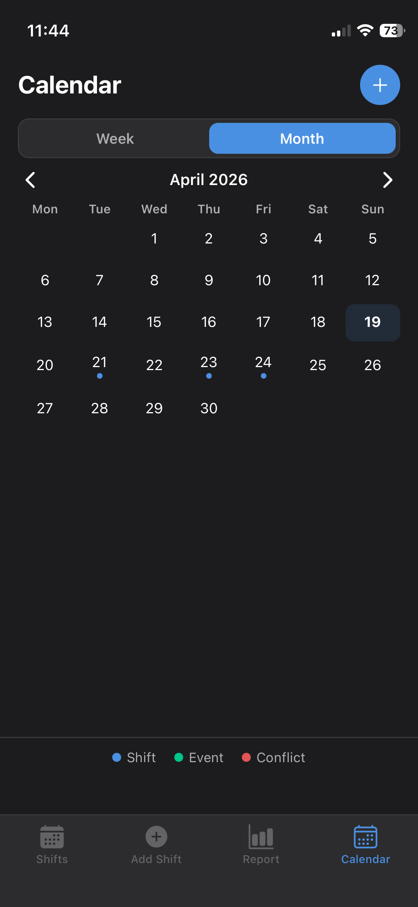

# Rota — AI-Powered Shift Tracker

A React Native (Expo) iOS app that parses shift schedules from SMS using AI, tracks working hours, manages events, and estimates weekly earnings.

---

## Features

- **AI SMS Parsing** — Paste a shift SMS and Gemini AI extracts dates, times, breaks and saves them automatically
- **Shift Management** — View, save and delete shifts with status tracking
- **Weekly Report** — See hours worked per week with per-week hourly rate and estimated earnings
- **Calendar View** — Week and month toggle with vertical timeline, shift and event blocks, conflict detection
- **Event Management** — Add personal events with title, date, time and optional notes
- **Conflict Detection** — Visual red pill when a shift and event overlap on the same time
- **Local Notifications** — Reminders the night before, 30 mins before, at clock-in and clock-out
- **Dark Mode** — Optimised for LCD screens (iPhone 12 Mini friendly)

## Screenshots

|                                               |                                             |
| :-------------------------------------------: | :-----------------------------------------: |
|                   **Home**                    |                **Add Shift**                |
|               |    |
|                **AI Preview**                 |              **Weekly Report**              |
|  |         |
|              **Calendar — Week**              |            **Calendar — Month**             |
|           |  |

---

## Tech Stack

| Layer         | Technology                             |
| ------------- | -------------------------------------- |
| Framework     | React Native + Expo                    |
| Navigation    | Expo Router (file-based)               |
| Database      | SQLite via expo-sqlite                 |
| AI Parsing    | Google Gemini 2.5 Flash API            |
| Notifications | expo-notifications                     |
| Icons         | @expo/vector-icons (Ionicons)          |
| Date Picker   | @react-native-community/datetimepicker |

---

## Project Structure

```
my-roster/
├── app/
│   ├── (tabs)/
│   │   ├── _layout.tsx        # Tab navigation
│   │   ├── index.tsx          # Home — shift list
│   │   ├── paste.tsx          # Add shift via SMS
│   │   ├── calendar.tsx       # Calendar view
│   │   └── report.tsx         # Weekly report & earnings
│   ├── modal/
│   │   └── add-event.tsx      # Add event screen
│   └── _layout.tsx            # Root layout + DB init
├── src/
│   ├── constants/
│   │   └── index.ts           # Colors, WMO codes, notification IDs
│   ├── services/
│   │   ├── aiParser.ts        # Gemini API integration
│   │   ├── database.ts        # SQLite operations
│   │   └── notifications.ts   # Expo notifications
│   ├── utils/
│   │   └── time.ts            # Time parsing helpers
│   └── types/
│       └── index.ts           # TypeScript interfaces
└── assets/
    └── images/
        ├── icon.png
        └── splash.png
```

---

## Getting Started

### Prerequisites

- Node.js 18+
- Expo CLI
- iOS device or simulator
- Xcode (for physical device builds)
- Google Gemini API key (free at [aistudio.google.com](https://aistudio.google.com))

### Installation

```bash
# Clone the repo
git clone https://github.com/yourusername/my-roster.git
cd my-roster

# Install dependencies
npm install

# Create environment file
cp .env.example .env
```

Add your Gemini API key to `.env`:

```
EXPO_PUBLIC_GEMINI_API_KEY=your_api_key_here
```

### Running in Development

```bash
npx expo start
```

Scan the QR code with Expo Go on your iPhone, or run on a simulator.

### Building for Physical Device

```bash
# Development build (hot reload enabled)
npx expo run:ios --device

# Release build (standalone, no Mac needed after install)
npx expo run:ios --device --configuration Release
```

### Rebuilding after Icon or Native Changes

```bash
npx expo prebuild --platform ios --clean
npx expo run:ios --device --configuration Release
```

---

## Environment Variables

| Variable                     | Description                              |
| ---------------------------- | ---------------------------------------- |
| `EXPO_PUBLIC_GEMINI_API_KEY` | Google Gemini API key for AI SMS parsing |

---

## Database Schema

### shifts

| Column      | Type | Description            |
| ----------- | ---- | ---------------------- |
| id          | TEXT | Unique identifier      |
| date        | TEXT | YYYY-MM-DD format      |
| startTime   | TEXT | e.g. "9:00 AM"         |
| endTime     | TEXT | e.g. "5:00 PM"         |
| location    | TEXT | Optional location      |
| role        | TEXT | Optional role/position |
| notes       | TEXT | Optional notes         |
| hoursWorked | REAL | Calculated hours       |
| status      | TEXT | upcoming / completed   |
| rawSMS      | TEXT | Original SMS text      |
| createdAt   | TEXT | ISO timestamp          |

### events

| Column    | Type | Description       |
| --------- | ---- | ----------------- |
| id        | TEXT | Unique identifier |
| title     | TEXT | Event name        |
| date      | TEXT | YYYY-MM-DD format |
| startTime | TEXT | e.g. "2:00 PM"    |
| endTime   | TEXT | e.g. "3:00 PM"    |
| notes     | TEXT | Optional notes    |
| createdAt | TEXT | ISO timestamp     |

### week_rates

| Column  | Type | Description               |
| ------- | ---- | ------------------------- |
| weekKey | TEXT | Monday date of the week   |
| rate    | REAL | Hourly rate for that week |

---

## How AI Parsing Works

1. User pastes shift SMS (auto-reads from clipboard)
2. SMS text is sent to Gemini 2.5 Flash with a structured prompt
3. Gemini returns a JSON array of shifts with date, startTime, endTime, location, role, notes
4. Shifts with breaks are split into segments with accurate total hours
5. User previews parsed shifts before saving
6. On save, shifts are stored in SQLite and notifications are scheduled

Example SMS:

```
Hi Harry can you come Fri 11-2:30 and Sat 11-9?
There's a break 2:30-4:00 on Saturday.
```

Parsed output:

```json
[
  { "date": "2026-04-24", "startTime": "11:00 AM", "endTime": "2:30 PM" },
  {
    "date": "2026-04-25",
    "segments": [
      { "startTime": "11:00 AM", "endTime": "2:30 PM" },
      { "startTime": "4:00 PM", "endTime": "9:00 PM" }
    ],
    "totalHours": 8.5
  }
]
```

---

## Notifications

| Trigger              | Notification                                     |
| -------------------- | ------------------------------------------------ |
| Night before shift   | "📋 Shift Tomorrow — You work 9:00 AM – 5:00 PM" |
| 30 mins before       | "⏰ Shift in 30 minutes — Get ready!"            |
| Shift start          | "✅ Clocked In — Good luck! 💪"                  |
| Shift end            | "🎉 Shift Complete! — You worked X hours"        |
| 30 mins before event | "⏰ Event name in 30 mins"                       |
| Event start          | "🗓 Event name — Starting now"                   |

---

## Color Palette

```typescript
bg: "#1C1C1E"; // iOS system gray — LCD friendly
card: "#2C2C2E";
border: "#3A3A3C";
blue: "#4A90E2"; // Primary accent
green: "#00C48C"; // Success / earnings
red: "#E25555"; // Errors / conflicts
textPrimary: "#FFFFFF";
textSecond: "#AEAEB2";
textMuted: "#636366";
```

---

## Known Limitations

- iOS only (no Android build configured)
- Requires internet connection for AI parsing
- Free Apple Developer account = 7 day certificate expiry (rebuild required)
- Notifications require permission grant on first launch

---

## Roadmap

- [ ] No-as-a-service excuse generator (shake to get an excuse not to work)
- [ ] Export weekly report as PDF
- [ ] Tax estimate based on Australian tax brackets
- [ ] Auto shift status (upcoming → completed after shift ends)
- [ ] Android support

---

## License

MIT

---

## Author

Built by Thi Han Hein — [github.com/micaljon60](https://github.com/micaljohn60)
